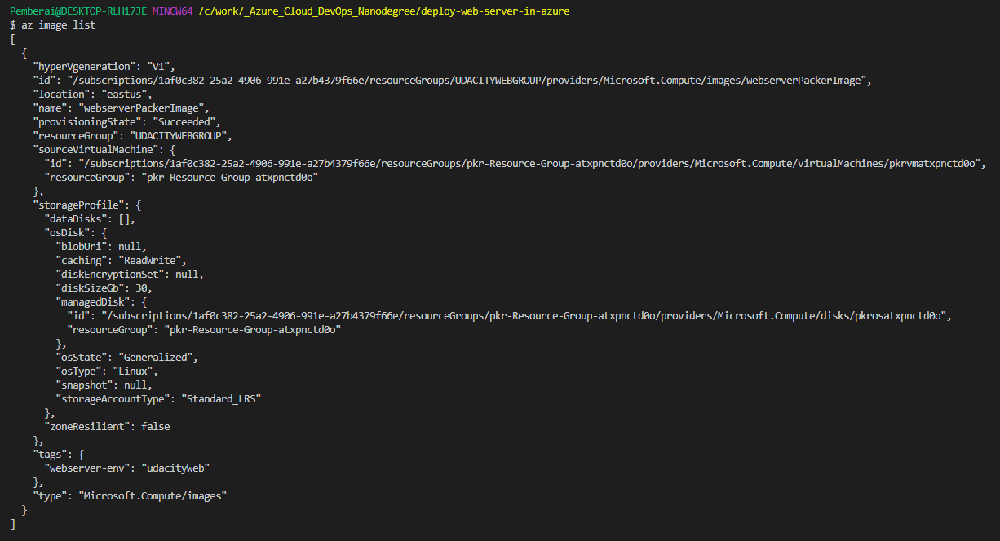

# Azure Infrastructure Operations Project: Deploying a scalable IaaS web server in Azure

> This project demonstrates how to create infrastructure as code—in the form of a Terraform template—in order to deploy a website with a load balancer. In this project we create a policy, a Packer template and a Terraform template to deploy a customizable, scalable web server in Azure.


## Description

The project is split into five parts:
1. Setup
2. Create and Deploy a Policy
3. Create Packer Template
4. Terraform Template
5. Deploying the Infrastructure

### Introduction
This project demonstrates how to create infrastructure as code—in the form of a Terraform template—in order to deploy a website with a load balancer. In this project we create a policy, a Packer template and a Terraform template to deploy a customizable, scalable web server in Azure.

### Getting Started
1. Clone this repository
```sh
$ git clone https://github.com/thepembeweb/deploy-web-server-in-azure.git
```
2. Install the project dependencies (indicated below)

### Dependencies
1. Create an [Azure Account](https://portal.azure.com) 
2. Install the [Azure command line interface](https://docs.microsoft.com/en-us/cli/azure/install-azure-cli?view=azure-cli-latest)
3. Install [Packer](https://www.packer.io/downloads)
4. Install [Terraform](https://www.terraform.io/downloads.html)

### Instructions
1. Get necessary azure credentials needed for your deployment
    - On your terminal do `az login`, the results will give your subscription id which is the id field in the ouput.
        ```
        [
            {
                "cloudName": "AzureCloud",
                "homeTenantId": "xxxxxxxxxxxxxxxxxxxx",
                "id": "xxxxxxxxxxxxxxxxxxxxxxxxxxxxxx",
                "isDefault": true,
                "managedByTenants": [],
                "name": "Free Trial",
                "state": "Enabled",
                "tenantId": "xxxxxxxxxxxxxxxxxxxxxxxxxxxx",
                "user": {
                "name": "xxxxxxx",
                "type": "user"
                }
            }
        ]

        ```
    - Create an azure service principal for terraform using the command below 
        ` az ad sp create-for-rbac --query "{ client_id: appId, client_secret: password, tenant_id: tenant }"`. You should get an output similar to:
         ```
        {
            "client_id": "xxxxxxxxxxxxxxxxxxxx",
            "client_secret": "xxxxxxxxxxxxxxxxxxx",
            "tenant_id": "xxxxxxxxxxxxxxxxxxxxxxx"
        }

        ```

    - Create a resource group using the command
        ```
        az group create -n myResourceGroup -l eastus

        ```
 2. Create and Deploy virtual machine Image to Azure using Packer.
    Set the client_id, client_secret and tenant_id as environment variables or copy them into a file e.g packer-vars.json and run the following command to create and deploy your image to azure.
    
        packer build -var-file packer-vars.json server.json
        
 3. Customize terraform IaaS code and Deploy
    In the terrafom.tfvars file, the vm_count variable can be modified to the number of virtual machines you want created. By default, 2 VMs are created.
    Also, in this file, provide the client id, secret and other required information.
    Run the following commands to deploy your infrastructure:
    first you initialise your terraform state, then get the plan of the resources that are to be deployed and finally run the apply command to create those resources on azure
       
        $ terraform init
        $ terraform plan 
        $ terrafrom apply
        
 4. Destroy Infrastructure
    When you are done using the infrastructure, destroy it using the command
      
        terrafrom destroy     
    
### Output
#### Below is a screenshot of what to expect after deploying the policy to azure.


#### Below is a screenshot of what to expect after running the building and deploying the packer image to azure.


#### Below is a screenshot of the results of the terraform apply command


## Built With

* [Azure](https://portal.azure.com/) - Cloud service provider used
* [Packer](https://www.packer.io/downloads) - Image template deployment tool
* [Terraform](https://www.terraform.io/) - Cloud infrastructure resource provisioning service used

## Authors

* **[Pemberai Sweto](https://github.com/thepembeweb)** - *Initial work* - [Deploying a scalable IaaS web server in Azure](https://github.com/thepembeweb/deploy-web-server-in-azure)

## License

[](http://badges.mit-license.org)

- This project is licensed under the MIT License - see the [LICENSE.md](LICENSE.md) file for details
- Copyright 2020 © [Pemberai Sweto](https://github.com/thepembeweb).

